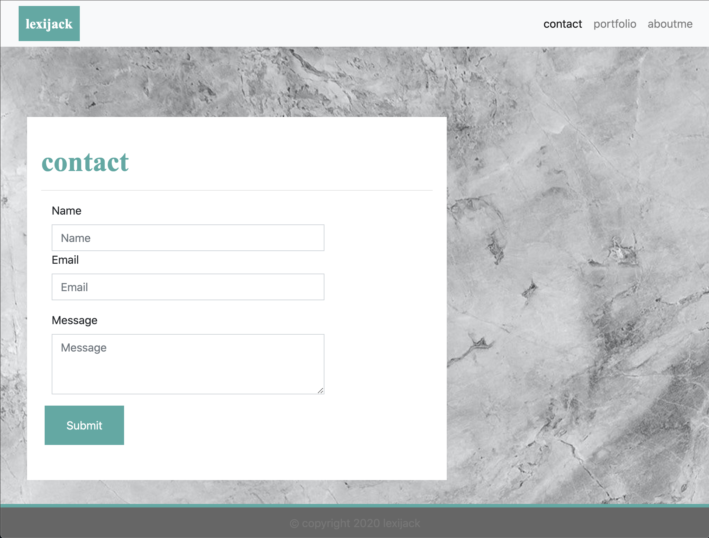

# Responsive Portfolio

[Deployed Project](https://puakehaulani.github.io/bc.hw2/)  
[Github Repo](https://github.com/puakehaulani/bc.hw2)

## About the Project

**Responsive Portfolio** is Homework 2 for UW Coding Bootcamp. We were instructed to create a responsive portfolio using Bootstrap. We were given example images to recreate for three linked webpages: an About Me (Index), a Portfolio, and a Contact page.  
I focused on creating the format of the page primarily with Bootstrap classes, and made small changes in the CSS stylesheet to match the styling to the sample images. Bootstrap allowed me to make the contents of the page responsive to screen size changes by taking advantage of the container, rows, and columns, as well as the precoded Bootstrap classes.

  
  


### Built With

Bootstrap

<!--include strategy-->

## Installation

Clone the repo

```bash
git clone git@github.com:puakehaulani/bc.hw2.git
```

## Contributing

Pull requests are welcome. For major changes, please open an issue first to discuss what you would like to change.

## License

© 2019 Trilogy Education Services, a 2U, Inc. brand.
All Rights Reserved.

## Project Status

Currently this homework assignment is completed and submitted for grade. Further updates to the Portfolio will be coming in the future in later assignments.
